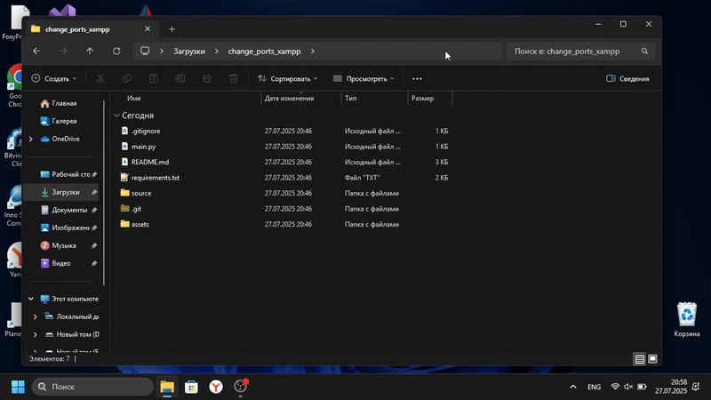
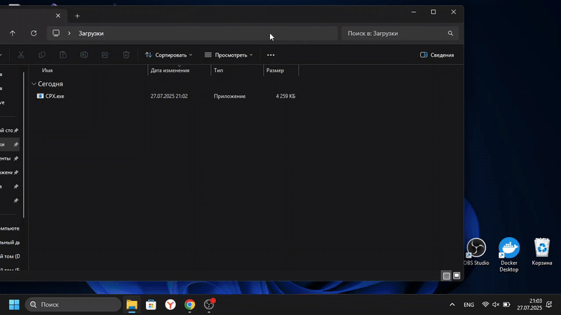
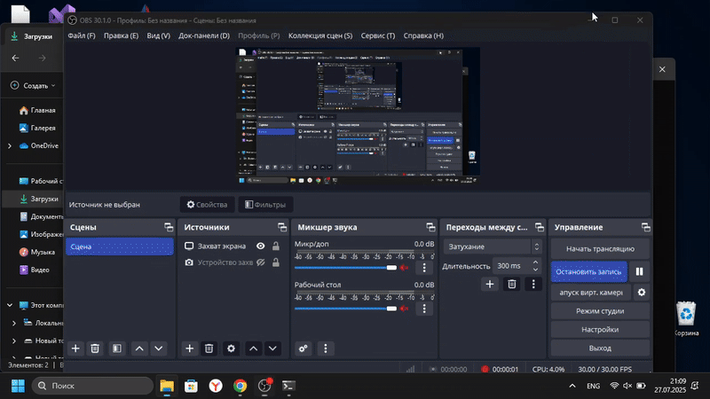

# Change Ports Xampp

       
<hr>
Скрипт, сделанный для того чтобы легко изменять порты в xampp ( Только Windows )
<hr>

## Содержание

- [Change Ports Xampp](#change-ports-xampp)
- [Содержание](#содержание)
- [Установка и запуск скрипта](#установка-и-запуск-скрипта)
  - [Затем, после того как клонировали репозиторий, вам нужно перейти в него](#затем-после-того-как-клонировали-репозиторий-вам-нужно-перейти-в-него)
- [Другой пример использования](#другой-пример-использования)
- [EXE](#exe)
  - [Файл EXE](#файл-exe)
  - [Архив с EXE](#архив-с-exe)
- [АРГУМЕНТЫ](#аргументы)
- [Ответственность пользователя](#ответственность-пользователя)

## Установка и запуск скрипта

Сначала клонируйте репозиторий

```bash
git clone https://github.com/separeit894/change_ports_xampp
```

### Затем, после того как клонировали репозиторий, вам нужно перейти в него

Перед тем как запускаете скрипт, не забудьте переместить содержимое в корневую директорию xampp

Запускаем скрипт

```bash
python main.py
```

## Другой пример использования

__Так же устанавливаем нужные библиотеки, но при этом не перемещаем программу в директорию XAMPP__



## EXE

### Файл EXE



### Архив с EXE



## АРГУМЕНТЫ


[Документация по использованию аргументов к программе](docs/ARGUMENTS.md)


## Ответственность пользователя

**Используя этот проект, вы соглашаетесь с тем, что несете полную ответственность за его использование. Разработчик не несет ответственности за любые убытки, повреждения или другие последствия, возникающие в результате использования данного программного обеспечения. Пожалуйста, используйте его на свой страх и риск.**

