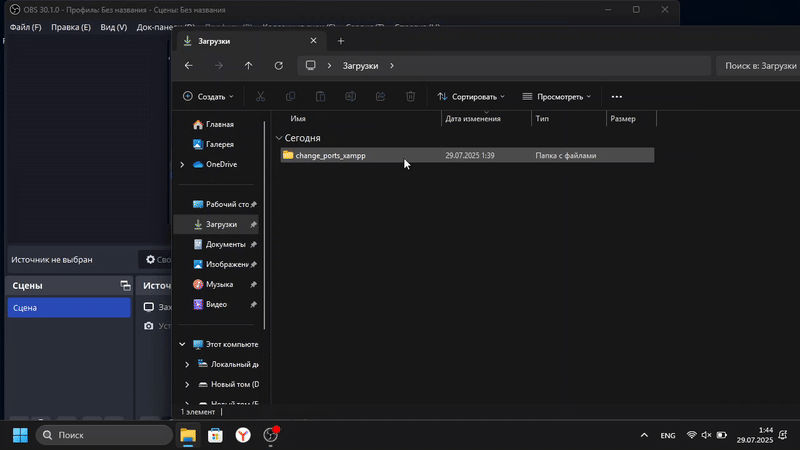
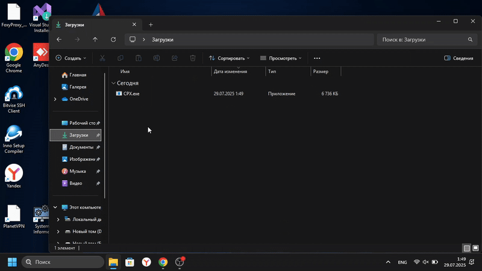
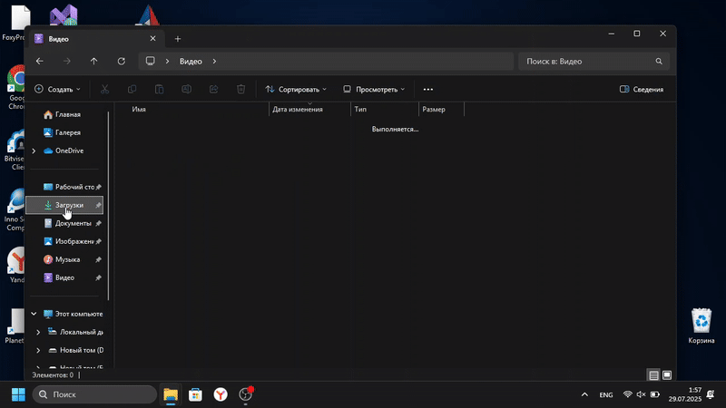

# Change Ports Xampp

    

Скрипт, сделанный для того чтобы легко изменять порты в xampp ( Только Windows )

## Установка и запуск скрипта

Сначала клонируйте репозиторий

```bash
git clone https://github.com/separeit894/change_ports_xampp
```

### Затем, после того как клонировали репозиторий, вам нужно перейти в него

Перед тем как запускаете скрипт, не забудьте переместить содержимое в корневую директорию xampp

Запускаем скрипт

```bash
python main.py
```

## Другой пример использования

Так же устанавливаем нужные библиотеки, но при этом не перемещаем программу в директорию XAMPP



## Если вы будете использовать версию exe, то его можно использовать как в примерах снизу

### Файл EXE



### Архив с EXE



## Аргументы

### **--help** или **-h** 

- **Описание**: Выводит описание программы, другие аргументы, которые можно использовать
- **Примеры**: 
```bash
python main.py --help
```
```bash
python main.py -h
```

### **--version** или **-v**
- **Описание**: Выводит версию программы
- **Примеры**: 
```bash
python main.py --version
```
```bash
python main -v
```

### **--console** 
- **Описание**: Запускает программу в консольном режиме
- **Пример**: 
```bash
python main.py --console
```

### **--no_admin**
- **Описание**: Запускает программу убирая возможность перезапуска с правами администратора
- **Примеры**: 
```bash
python main.py --no_admin
```
В CLI
```bash
python main.py --console --no_admin
```

## Ответственность пользователя

Используя этот проект, вы соглашаетесь с тем, что несете полную ответственность за его использование. Разработчик не несет ответственности за любые убытки, повреждения или другие последствия, возникающие в результате использования данного программного обеспечения. Пожалуйста, используйте его на свой страх и риск.
